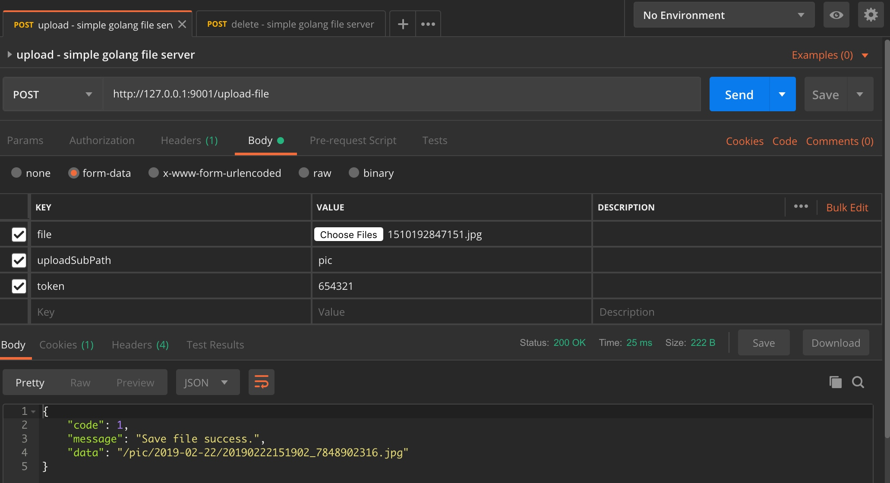
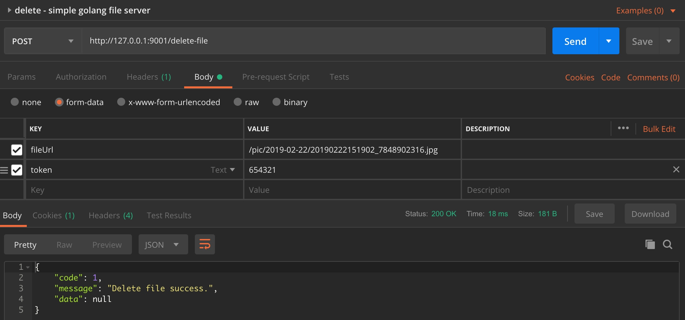

# SGFS

## Simple Golang File Server
SGFS, a open source file server, implement by golang that can be used to upload and download files. Simple to deploy, simple to use. 

## Advantage
- *SGFS* is easy to configure and deploy. (use yaml config and **have no runtime dependencies**)

- *SGFS* is easy to start and stop. (use **./startup.sh** to start and use **./shutdown.sh** to stop)

- *SGFS* is easy to use. (use HTTP to upload and delete file)

- *SGFS* use fasthttp to implement. (strong ability to deal with concurrent problems and fast speed. [https://github.com/valyala/fasthttp])

## Quick Start
-  Download release version.  
    https://github.com/LinkinStars/sgfs/releases
-  Configure *conf.yml* .  
(You don't have to configure it, but you'd better have a look.)
-  Start server

    ````
    $ ./startup.sh
    ````
    
- Test to upload file  
I use postman to test and you can use any other methods(by HTTP).

If the response json have code and the code is 1, Congratulations, the file upload success. If not, you can follow the message to fix the problem.

 
- Visit file  
    http://127.0.0.1:9002/pic/2019-02-22/20190222151902_7848902316.jpg  
    If you set **conf.yml** generate_index_pages is true, you can visit the index page.  
    http://127.0.0.1:9002/  
    
- Delete file  



- Stop server  

    ````
    $ ./shutdown.sh
    ````

## HTTP

#### Upload file
Url : "http://127.0.0.1:8080/upload-file"  
Method : "http + post + multipart/form-data"  

Request  

| key | value |
| --- | --- |
| file | upload file |
| uploadSubPath | file save path，like “pic” |
| token | operation_token，like “654321” |

Response  

````json
{
    "code": 1,
    "message": "Save file success.",
    "data": "/pic/2019-02-22/20190222151902_7848902316.jpg"
}
````

code = 1 means success  
code != 1 means fail  

#### Delete file
Url : "http://127.0.0.1:8080/delete-file"  
Method : "http + post + multipart/form-data"  

Request  

| key | value |
| --- | --- |
| fileUrl | like "/pic/2019-02-22/20190222151902_7848902316.jpg" |
| token | operation_token，like "654321" |

Response  

````json
{
    "code": 1,
    "message": "Delete file success.",
    "data": null
}
````

code = 1 means success  
code != 1 means fail  


